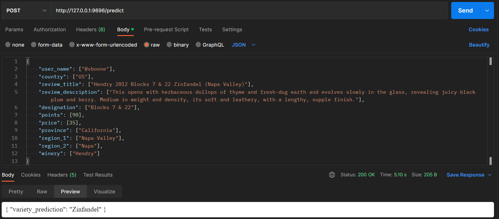

# SenseGrass-Task
## How to use:
### Run API
```shell
cd SenseGrass-Task
python3 main.py
```
### Post Request
```shell
python3 requests.py
```
<p align="center">
  
</p>

## ML Specs:
- LightGBM Classifier
- Accuracy: 0.7
- Path: model_files/lgbm_model.zip

